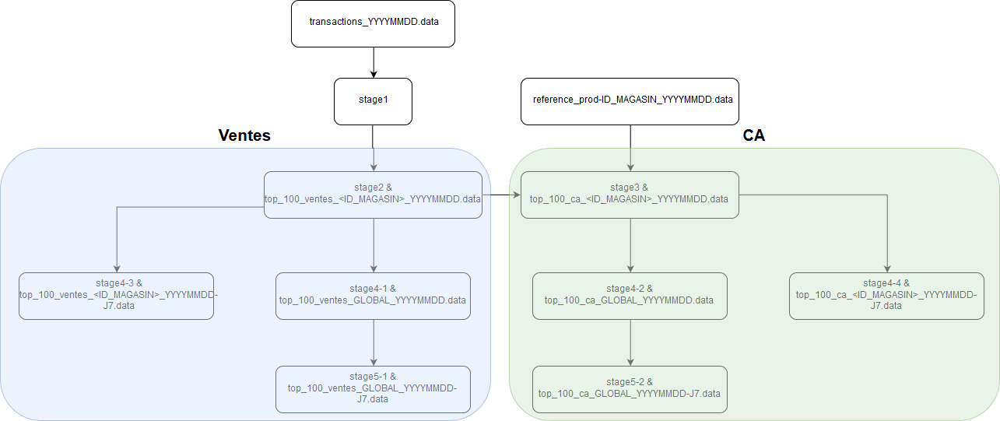

Ceci est un projet répondant une problématique de traitement des données provenant des tickets de caisse pour Carrefour. 

Il permet, à partir des fichiers de logs de transactions journaliers, et de fichiers de référentiels produit-prix pour chaque magasin, de générer les indicateurs suivants : 
1.  `top_100_ventes_<ID_MAGASIN>_YYYYMMDD.data`
2.  `top_100_ventes_GLOBAL_YYYYMMDD.data`
3.  `top_100_ca_<ID_MAGASIN>_YYYYMMDD.data`
4.  `top_100_ca_GLOBAL_YYYYMMDD.data`
5.  `top_100_ventes_<ID_MAGASIN>_YYYYMMDD-J7.data`
6.  `top_100_ventes_GLOBAL_YYYYMMDD-J7.data`
7.  `top_100_ca_<ID_MAGASIN>_YYYYMMDD-J7.data`
8.  `top_100_ca_GLOBAL_YYYYMMDD-J7.data`

Les noms des fichiers de transactions doivent être au format suivant : *transactions_YYYYMMDD.data* et doivent contenir des données au format suivant : `transactionId|datetimeISO8601|magasinId|produitId|qte`

Les noms des fichiers de référentiels produit-prix doivent être au format suivant : `reference_prod-ID_MAGASIN_YYYYMMDD.data` et doivent contenir des données au format suivant : `produit|prix`

# Builder le projet

## Prérequis  
+ Java 8 (https://www.oracle.com/technetwork/java/javase/downloads/jdk8-downloads-2133151.html)
+ Maven (https://maven.apache.org/install.html)
## Builder le projet avec maven

`mvn clean install`

Lors du build, les tests sont réalisés. Les tests utilisent les données présentes dans le répertoire data du repository. 
Si vous n'avez pas récupéré ces données, vous pouvez builder le projet sans passer les tests : 

`mvn clean install -DskipTests`

# Lancer le projet

Afin de lancer le projet, il faut se placer dans le répertoire parent du répertoire *data* où se trouvent les données. 

On peut ensuite lancer la commande suivante : 

`java -jar -Xms128m -Xmx512m target/CarrefourIndicatorGenerator-jar-with-dependencies.jar --<stage> --topN=<topN> --file=data/<fichier_transactions>`

Avec  : 
+ *stage* qui prend une des valeurs suivantes (sans les ""): *{"venteMagasin", "caMagasin", "venteGlobal", "caGlobal", "venteMagasinJ7", "caMagasinJ7", "venteGlobalJ7", "caGlobalJ7", "all"}*
+ *topN* : sur combien de produits doit être réalisé le classement
+ *file* : le fichier de transactions   

Exemple : java -jar -Xms128m -Xmx512m target/CarrefourIndicatorGenerator-jar-with-dependencies.jar --all --topN=100 --file=data/transactions_20170514.data
 
Les fichiers de résultats seront produit dans le répertoire *./result*

# Fonctionnement

Le traitement des données se fait via un workflow. Ce workflow permet, selon le stage demandé, de réaliser uniquement les traitements nécessaires pour produire le fichier de résultat demandé.

Les explications qui suivent détaillent le fonctionnement du workflow complet, c'est-à-dire avec l'ensemble des traitements qu'il est capable de lancer.

Le traitement est divisé en 9 étapes de calcul.
Si une étape de calcul génère un indicateur attendu (topvente/magasin, topca/magasin,etc.), le fichier adéquat est produit dans le répertoire *./result* 

Le résultat complet de chaque étape est écrit sur disque afin de pouvoir les réutiliser pour un traitement futur. 

En tout, 9 traitement sont réalisés. Voici le contenu des fichiers produits par chacun : 

+ ***stage1*** :  un fichier par magasin présent dans le fichier de transactions, où chaque ligne contient *produit|qte* avec ***PLUSIEURS*** occurrences pour chaque*produit*. Ici, *qte* contient ne contient que la *qte* présente sur la ligne du fichier *transactions*.
+ ***stage2*** : un fichier par magasin, où chaque ligne contient *produit|qte* avec une seule occurrence de chaque produit. Ici, *qte* contient le nombre de ventes total du produit pour le magasin en question. A ce stage, on peut donc générer `top_N_ventes_<ID_MAGASIN>_YYYYMMDD.data` pour chaque magasin. 
+ ***stage3*** : un fichier par magasin, où chaque ligne contient *produit|ca* avec une seule occurrence de chaque produit. Ici, *ca* contient le CA total du produit sur le magasin en question. A ce stage, on peut donc générer `top_N_ca_<ID_MAGASIN>_YYYYMMDD.data`
+ ***stage4-1*** : un seul fichier par jour pour l'ensemble des magasins. Chaque ligne contient *produit|qte* où *qte* est le nombre de vente total du produit sur l'ensemble des magasin. A ce stage, on peut donc générer `top_N_vente_GLOBAL_YYYYMMDD.data`
+ ***stage4-2*** : un seul fichier par jour pour l'ensemble des magasins. Chaque ligne contient *produit|ca* où *ca* est le CA total du produit sur l'ensemble des magasins. A ce stage, on peut donc générer `top_N_ca_GLOBAL_YYYYMMDD.data`

Les stages suivant sont le résultat des agrégation sur 7 jours. Ils ne peuvent être produits  que si les données nécessaires (sur les 7 derniers jours) sont présentes dans les stages précédents.
+ ***stage4-3*** : un fichier par magasin, où chaque ligne contient *produit|qte* où *qte* est le nombre de ventes total du produit sur les 7 derniers jours pour le magasin en question. A ce stage, on peut dont générer `top_N_vente_<MAGASIN_ID>_YYYYMMDD-J7.data`
+ ***stage4-4*** : un fichier par magasin, où chaque ligne contient *produit|ca* où *ca* est le CA total du produit sur les 7 derniers jours pour le magasin en question. A ce stage, on peut dont générer `top_N_ca_<MAGASIN_ID>_YYYYMMDD-J7.data`
+ ***stage5-1*** : un seul fichier pour les 7 derniers jours, où chaque ligne contient *produit|qte* où *qte* est le nombre de ventes total du produit sur les 7 derniers jours sur l'ensemble des magasins. A ce stage, on peut générer `top_N_vente_GLOBAL_YYYYMMDD-J7.data`
+ ***stage5-2*** : un seul fichier pour les 7 derniers jours, où chaque ligne contient *produit|ca* où *ca* est le CA total du produit sur les 7 derniers jours sur l'ensemble des magasins. A ce stage, on peut générer `top_N_ca_GLOBAL_YYYYMMDD-J7.data`

Les fichiers de chaque stage à partir du stage2 sont générés à partir d'une HashMap dont les clés sont les produitId et la valeur leur nombre de ventes ou leur CA. L'obtention du top N des ventes ou du CA se base sur cette HashMap pour réaliser son tri. 

Le fonctionnement peut être résumé avec le graphe ci-dessous :

Afin de réaliser les traitements, le projet contient 3 composants principaux :
+ TransactionFileMapper : cet objet permet de lire le fichier de *transactions* et de produire un fichier par magasin présent. Il est utilisé pour produire le *stage1*. Les fichiers produits contiennent donc plusieurs occurrences de chaque produit. Pour réaliser cela, le TransactionFileMapper maintient un BufferedOutputStream ouvert pour chaque magasin afin de mapper la donnée en cours vers le bon fichier.
+ Reducer : C'est l'objet principal du projet. Il permet, à partir d'un ensemble de fichiers de type identique (*produit|qte* ou *produit|ca*, contenant une seule ou plusieurs occurrences de chaque produit), de calculer la somme des *qte* ou du *ca* pour chaque produit. Il est utilisé pour produire les *stage2*, *stage4-1*, *stage4-2*, *stage4-3*, *stage4-4*, *stage5-1* et *stage5-2*. En effet, il attend en entrée un ensemble de fichiers. On peut donc lui fournir l'ensemble des fichiers nécessaires à la génération d'un résultat  GLOBAL, sur 7 jours, ou même un seul fichier contenant plusieurs occurrences de chaque produit (comme les fichiers du *stage1*). Globalement, le Reducer fonctionne comme ceci : 
1. Lecture de chaque fichier d'input et construction de la Map<produit, qte> ou Map<produit, CA> agrégeant les valeurs. 
2. Écriture du résultat dans le stage adéquat.
3. Tri des résultats et obtention du Top N.
4. Écriture du fichier indicateur obtenu dans le dossier *result*.
+ CACalculator : cet objet permet, à partir d'un fichier *reference_prod* d'un magasin et d'un fichier *stage2* (donc *produit|qte* avec une seule occurrence de produit par fichier) de calculer le CA de chaque produit. Il est utilisé pour produire le *stage3*. Globalement, le CACalculator fonctionne comme suit : 
1. Construction de la Map<produit, qte> à partir du fichier *stage2*
2.  Lecture du fichier *reference_prod* et calcul du CA de chaque produit. Suppression des produits non présents dans le fichier *reference_prod*.
3. Écriture du résultat dans le stage adéquat.
4. Tri des résultats et obtention du Top N.
5. Écriture du fichier indicateur obtenu dans le dossier *result*.

Enfin, la dernière partie importante du projet est l'algorithme de tri. En effet, cet algorithme est nécessaire afin de calculer le top N à chaque étape. 
Il est basé sur un MaxHeap et est représenté dans un tableau contenant l'id de chaque produit. Le tableau est construit à partir de l'ensemble des clés des Map précédemment évoquées. **Il n'est pas trié lors de sa construction.** 
Le tableau est ensuite ordonné en utilisant la Map depuis laquelle il a été créé afin d'ordonner les produits selon leur valeur de *qte* ou de *ca*. 
Cela permet d'obtenir une complexité de O(n) sur la construction de l'arbre. Cette structure de donnée permet ensuite de récupérer les k maximum avec  une complexité de *O(k \* log(n))*.

Plus de détails ici : https://www.geeksforgeeks.org/time-complexity-of-building-a-heap/ et ici : https://en.wikipedia.org/wiki/Binary_heap#Building_a_heap 

Vous pourrez trouver plus de détails dans les commentaires du code source.

## Tests de performance

+ Test sur 1 jour ; 1200 magasins ; 10000000 transactions ; 1000000 produits : 8'30"
+ Test sur 1 jour ; 600 magasins ; 10000000 transactions ; 1000000 produits : 5'26
+ Test sur 7 jours ; 500 magasins ; 10000000 transactions ; 500000 produits : 29'00"
